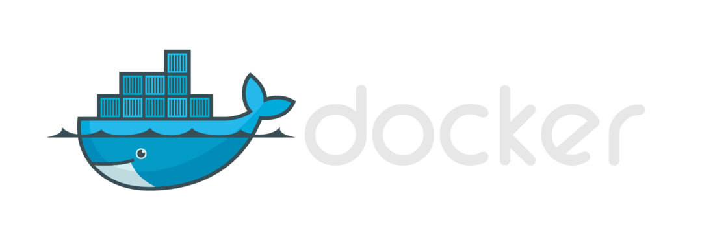
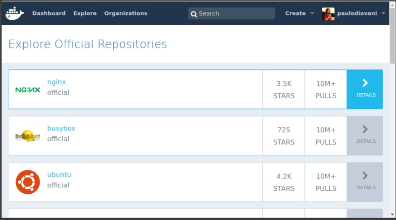

# Docker for Lazy People


https://www.flickr.com/photos/37060680@N04/4441496167 <!-- .element: class="credits" -->

Or how to use Docker to leverage dependency management and
reduce hard work

<small>Version 0.1.0</small>

====

About being lazy...

> ## Finally fired after 6 years
>
> 
> https://www.engadget.com/2016/01/08/blade-runner-replicant-birthday/ <!-- .element: class="credits" -->

<small>_Archive: https://web.archive.org/web/20160523114950/https://www.reddit.com/r/cscareerquestions/comments/4km3yc/finally_fired_after_6_years/_ </small><!-- .element: class="more" -->
<br>
<small>~~_Original source: https://www.reddit.com/r/cscareerquestions/comments/4km3yc/finally_fired_after_6_years/_~~</small><!-- .element: class="more" -->

Note:
A programmer, as said on reddit, had 6 years
doing nothing after automatic some test tasks.

Image: Roy Batty, from Blade Runner movie (1982)

====

<!-- .slide: class="half-slide" data-background="url(img/paulodiovani.jpg)" data-background-size="contain" data-background-repeat="no-repeat" data-background-position="right" -->

### <i class="fa fa-user"></i> Paulo Diovani Gonçalves

Technologist in Systems for Internet by Feevale University.
Software Enginer at Codeminer 42.
GNU/Linux user since 2005.

[blog.diovani.com][blog]

[slides.diovani.com][slides]

[@paulodiovani][twitter]

[![codeminer42][code-logo]][code-site] <!-- .element: class="no-border no-background" -->

[avatar]: img/avatar.jpg
[blog]: http://blog.diovani.com
[slides]: http://slides.diovani.com
[twitter]: http://twitter.com/paulodiovani
[code-logo]: img/codeminer42.png
[code-site]: http://codeminer42.com/

----

## Yet another talk about Docker

...not realy (or I hope so)

Note:
We have been having a lot of Docker talks recently.
Most of then a lot complicated.

====

```bash
# running a container on interactive tty
$ docker run -i -t image_name [command]

# forwarding ports
$ docker run -p 9999:9999 image_name

# mounting volumes
$ docker run -v /host/path:/guest/path image_name

# running on background
$ docker run -d image_name

# removing after use
$ docker run --rm -it image_name [command]
```

```bash
# hosting static content with NGINX
$ docker run --name some-nginx \
        -v /some/content:/usr/share/nginx/html:ro \
        -p 8080:80 \
        -d nginx
```

Note:
...Giving us a lot of sample commands hard to remember.

> Look at that huge command...

====

> ## It's the Future
>
> 

<small>_Source: https://circleci.com/blog/its-the-future/_</small><!-- .element: class="more" -->

Note:
A fun post on circle-ci blog introduces Docker and containers
(and a lot more) as ~~an alternative~~ the new way for a simple
web hosting.

Thanks, Azzi.

====

### The Docker ecosystem

Docker official tools          | Third Parties
---                            | ---
Docker Engine                  | Kitematic
Docker Compose                 | Azk
Docker Hub                     | Kubernetes
Docker Cloud                   | Apache Mesos
Docker Trusted Registry        | CoreOS
Docker Universal Control Plane |
Docker Machine                 |
Docker Toolbox (old)           |

Note:
And we have so much more

====

> # So much information,
> # I can't follow you!

Note:
The gotcha is that, even with the full, amazing,
capabilities of Docker, one cannot handle all
the information and deal with advantages at once.

...And a lot speakers want to tell you all of it. :(

====


https://infoslack.com/rubyconf2015/docker/#/13 <!-- .element: class="credits" -->

Note:
In the end, people just walk away from Docker. :'(

----

## Being practical

This talk introduces Docker in a way...

- Easy to understand
- Easy to use
- Functional
- Able to solve problems
- Just works

Note:
Goal: You'll be able to start using docker today,
with little or no impact on daily work

====

Docker

# Must be easier

For me to start using it

Note:
In short, this is why

----

 <!-- .element: class="no-border no-background" -->

A little words about Docker and containers

Note:
But what is Docker, anyway?

I promise that this is a brief introduction.

====

### Docker

> **Docker** is an open-source project that automates the
> deployment of applications inside software containers.

Note:
Source Wikipedia

====

### Docker

> Docker containers wrap a piece of software in a complete
> filesystem that contains **everything needed** to run: code,
> runtime, system tools, system libraries – anything that
> can be installed on a server. This guarantees that the
> software **will always run the same**, regardless of its
> environment.

Note:
source https://www.docker.com/what-docker

====

### Software container

> **Operating-system-level virtualization** is a server
> virtualization method in which the kernel of an operating
> system allows the existence of multiple isolated user-space
> instances, instead of just one.

Note:
Source Wikipedia

In other words, is a virtualization technique
that does not emulates hardware.

====

Docker is **not** about virtualization, it is about *services*

Note:
The tricky (and greatest) thing about Docker is
that it's made to run services, and not a full-fledged
environment.

----

## Before we start

====

### Images vs. Containers

- A Docker **image** is a _read only_ layer that can
  be packaged and distributed.
  + Images remain exactly the same wherever environment 
    they are used. <!-- .element: class="fragment" -->
- A Docker **container** is an instance of an image. it's
  a _writable_ layer used to run commands or store data.
====

### What do we need?

- Docker Engine
  + https://docker.com
- Docker Compose
  + https://docs.docker.com/compose/
- Docker Hub
  + https://hub.docker.com/

====

#### Docker Hub



https://hub.docker.com/

====

### Installation

- GNU/Linux
  + https://www.docker.com/products/docker#/linux
- Mac OSX
  + https://www.docker.com/products/docker#/mac
- MS Windows
  + https://www.docker.com/products/docker#/windows

====

#### Note 1: Arch Linux

```bash
$ sudo pacman -Sy docker docker-compose
```

Note:
The easiest distro to install Docker

====

#### Note 2: Mac and Windows

##### Before

- boot2docker (`until 1.7`)
- Docker Toolbox (`1.8 ~ 1.11`)
  - with Docker Machine

<p></p>
##### Now

- Docker for Mac (`since 1.12-rc3`)
  + requires Yosemite `10.10`
  + uses a `xhyve` based Hypervisor
- Docker for Windows (`since 1.12-rc3`)
  + requires Window `10 64bit`
  + uses `Hyper-V`

Note:
Until version 1.11 Docker for Mac and Windows
was not as easy to use, depending on a Virtual Box
VM, environment variables and etc.

Recenty, with 1.12, Docker uses a native client
and native Hypervisors.

----

## Managing dependencies should be easy

====
<!-- .slide: data-transition="slide-in fate-out" -->

### Potential application

- Ruby on Rails app
- PostgreSQL Database <!-- .element: class="fragment" -->
- Redis for Sidekick Worker <!-- .element: class="fragment" -->
- Elasticsearch for full-text searches <!-- .element: class="fragment" -->

Note:
Lets consider this potential, very common,
appication.

====
<!-- .slide: data-transition="fade" -->

### Potential application

- My code
  + Ruby on Rails app
- Volatile data
  + PostgreSQL Database
  + Redis for Sidekick Worker
  + Elasticsearch for full-text searches

Note:
The only layer I'm always working on is the
app code itself. Everything else I just don't
bother on configuring.

====
<!-- .slide: data-transition="fade-in slide-out" -->

### Potential application

- Host Machine
  + Ruby on Rails app
- Docker containers
  + PostgreSQL Database
  + Redis for Sidekick Worker
  + Elasticsearch for full-text searches

Note:
So, I could have only the Rails app on my machine
and let everything else on containers.

====

### Do not install what you won't actively use

- Cache stores
- CI Services
- Compilers
- Databases
- HTTP Servers
- Interpreters
- Libraries
- Load Balancer
- Proxy Servers

Note:
The idea is to NOT install what you doesn't have
to change/configure/edit frequently.

====

#### Why not?

- difficult to install
- version restrictions across different environments
- waste of system resources
- waste of time

Note:
Development dependencies are usually hard to install
and configure. And they heavy a lot on the machine.

----

## Docker compose

> Compose is a tool for defining and running multi-container Docker applications.

Note:
For now on, we'll be using Docker compose

====

### Orchestration

> **Orchestration** is the automated arrangement, coordination, and management of complex computer systems, middleware and services.

*Source: https://en.wikipedia.org/wiki/Orchestration_(computing)* <!-- .element: class="more" -->

Note:
Compose basicly does service orchestration.

====

### The <b class="lowercase">docker-compose.yml</b> file

`docker-compose.yml`

- Define services
- Restrict networks
- Mount volumes
- Forward ports

It can (and must) be versioned alongside code.

Note:
Everything is set up using a YAML config file.

====

### Using Docker Compose

```bash
$ docker-compose up    # create/run containers
$ docker-compose up -d # create/run containers in bg
$ docker-compose start # start exiting containers
$ docker-compose stop  # stop containers
$ docker-compose rm -v # remove container
$ docker-compose ps    # check containers
$ docker-compose logs  # see output logs
```

Note:
...and controller by a small bunch of commands.

----

## Sample application 1

Ruby on Rails + PostgreSQL + Redis + ElasticSearch

Note:
Learning by example.

Let's use our potential application services.

====

### Running only dependencies on Docker

Note:
In this example, we'll ignore the app and
just dealwith dependencies.

====

```yml
version: '2'

services:
  db:
    image: postgres
    environment:
      POSTGRES_DB: lazy_people
    ports: ["5432:5432"]

  redis:
    image: redis
    ports: ["6379:6379"]

  search:
    image: elasticsearch
    ports: ["9200:9200", "9300:9300"]
```

====

<iframe data-autoplay src="https://asciinema.org/api/asciicasts/79064?size=big" id="asciicast-iframe-79064" name="asciicast-iframe-79064" scrolling="yes" width="100%" height="768"></iframe>
